# Schema airsensor
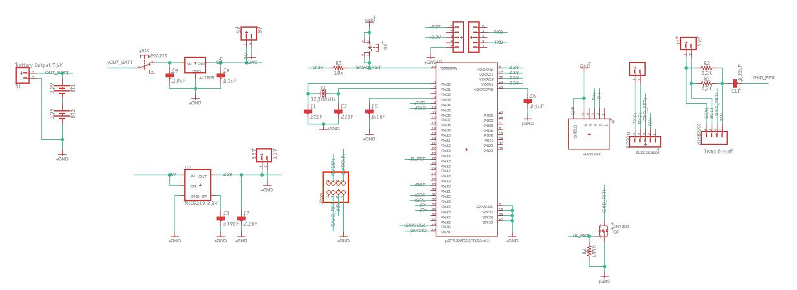

# Schema LoRaWAN
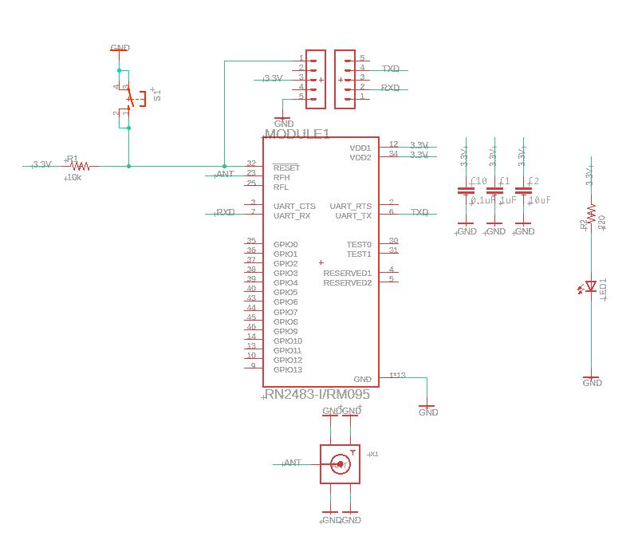

# Schema HIH8xxx
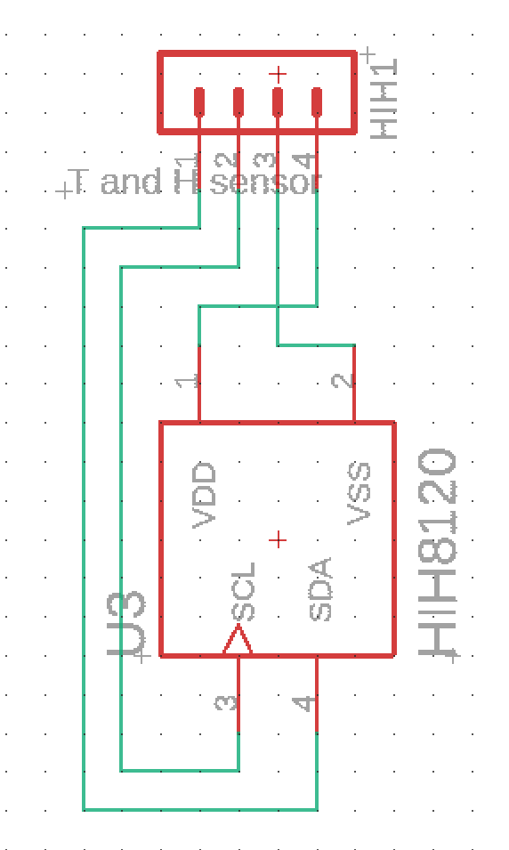

# Schema JTAG
<<<<<<< HEAD
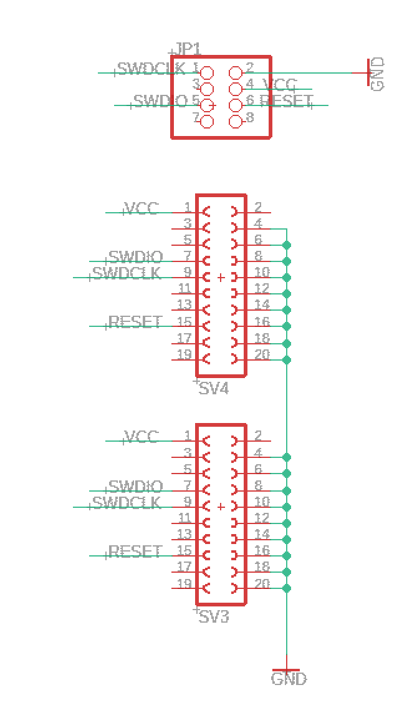
=======

>>>>>>> c74764702c0ad45f76e91693a2fbca707ce8f4d9

# PCB airsensor
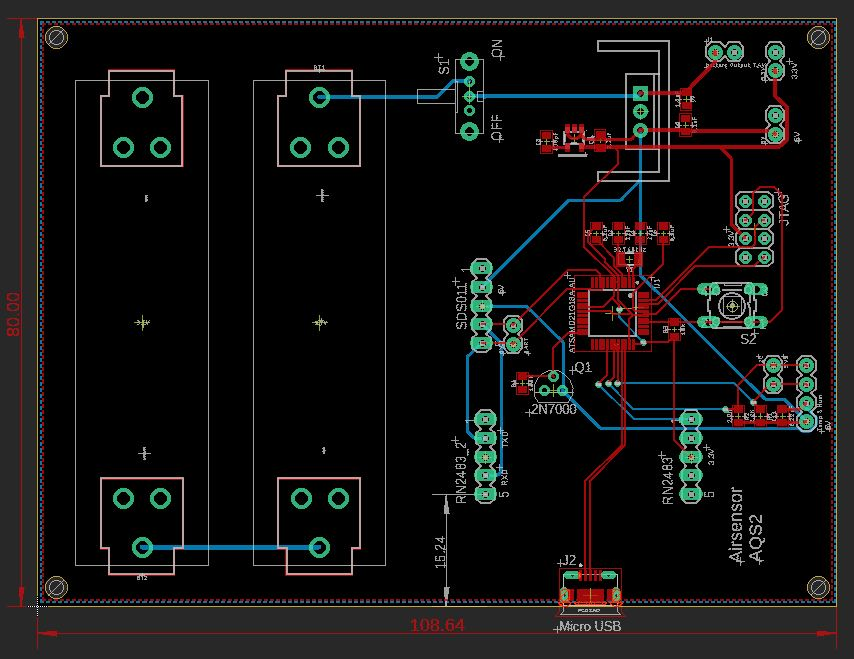

# PCB LoRaWAN
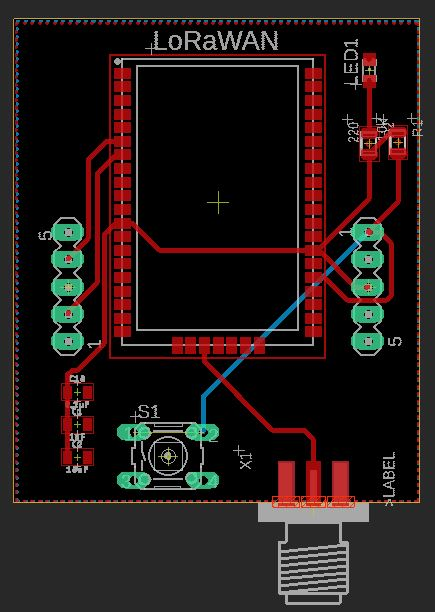

# PCB HIH8xxx
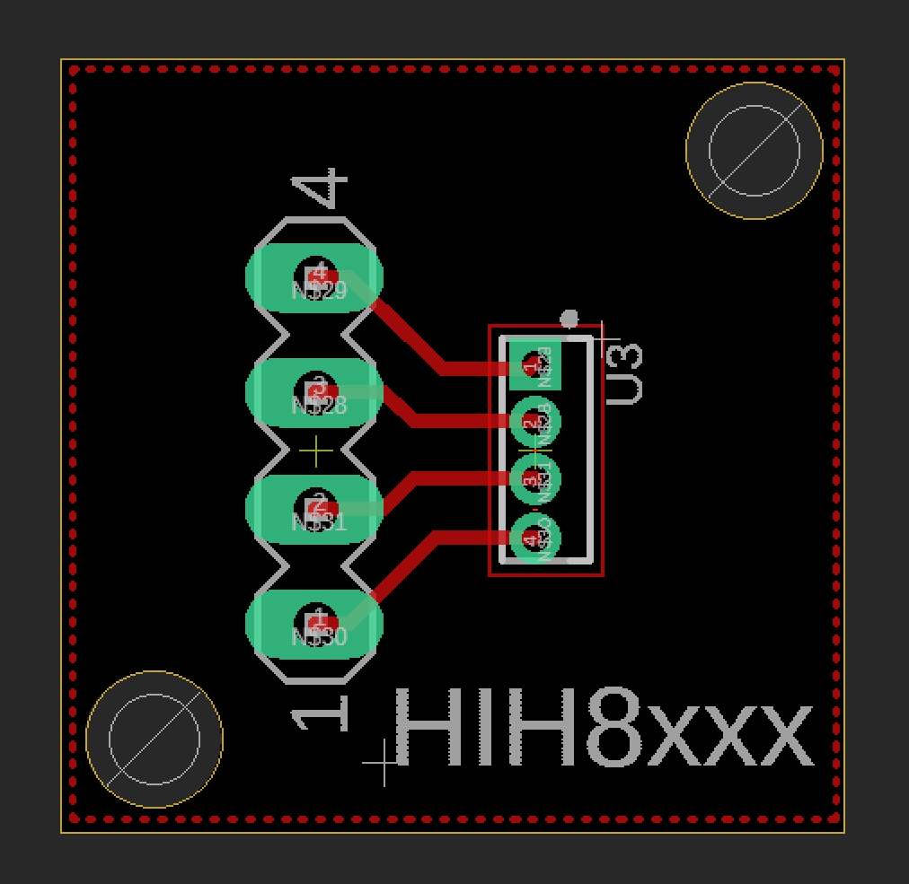

# PCB JTAG
<<<<<<< HEAD
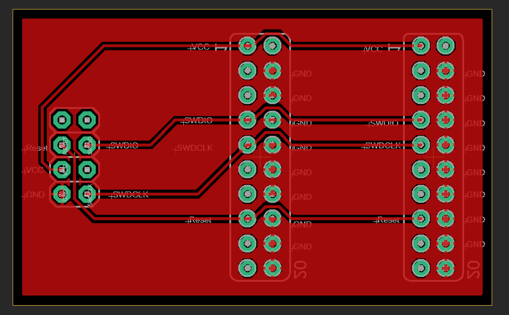
=======

>>>>>>> c74764702c0ad45f76e91693a2fbca707ce8f4d9

# 3D airsensor
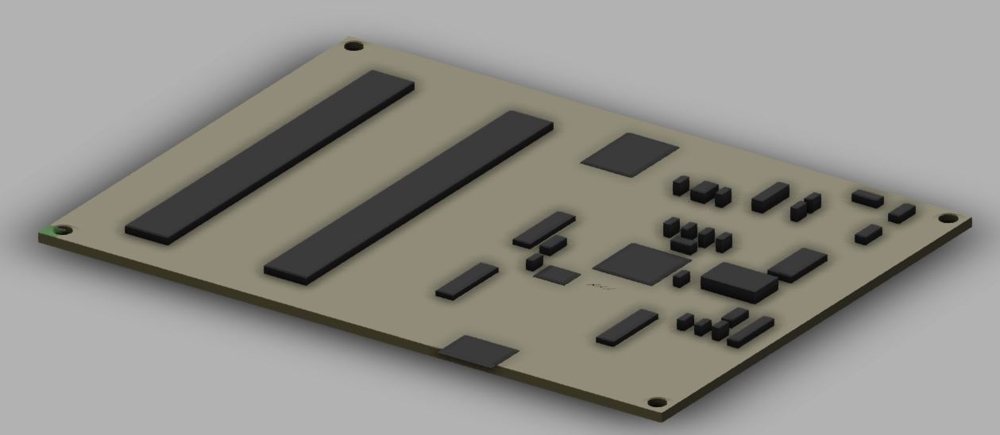

# 3D LoRaWAN
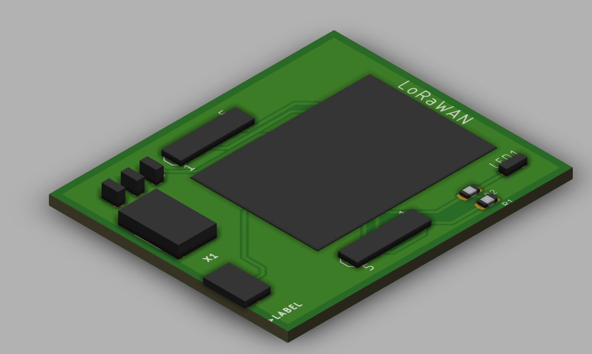

# 3D HIH8xxx
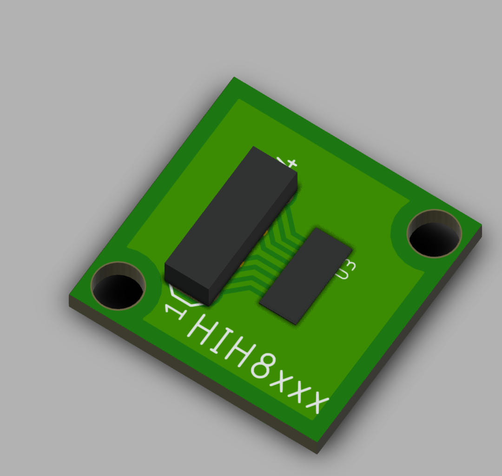

# 3D JTAG
<<<<<<< HEAD
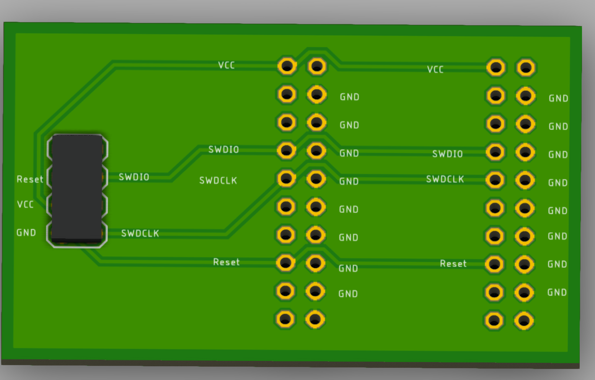
=======

>>>>>>> c74764702c0ad45f76e91693a2fbca707ce8f4d9
